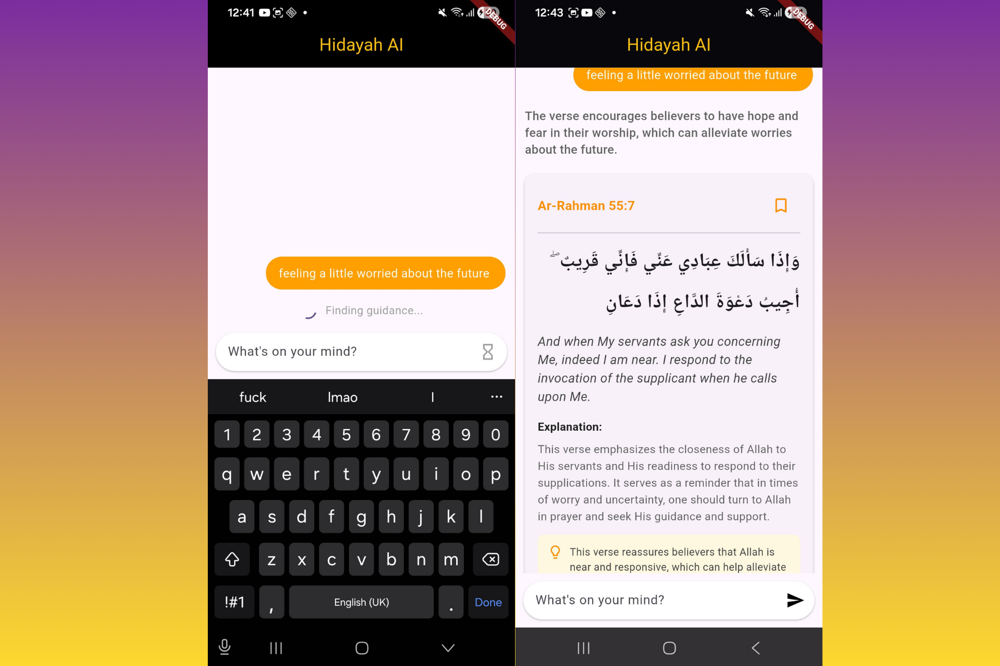

# Hidayah AI — Backend

FastAPI backend powering the Hidayah AI Quranic verse finder. Handles semantic search, LLM response generation, and verse recommendations based on a user's mood or situation.

> **Frontend repo:** [hidayah-frontend](https://github.com/emmanueluwa/verses_front)



## Tech Stack

- **Framework:** FastAPI (Python)
- **AI/LLM:** OpenAI API, LangChain, prompt engineering
- **Search:** Pinecone vector database, RAG pipeline
- **Database:** PostgreSQL, SQLAlchemy

## Getting Started

```bash
poetry install
poetry run uvicorn main:app --reload
```

## Environment Variables

```env
OPENAI_API_KEY=
INDEX_NAME=
PINECONE_API_KEY=
LANGCHAIN_API_KEY=
LANGCHAIN_TRACING_V2=
LANGCHAIN_PROJECT=
DATABASE_URL=/api
API_PREFIX=
DEBUG=False
ALLOWED_ORIGINS=
```

## API Endpoints

- `POST /api/verses/query` — Submit a query, returns verse recommendations and LLM summary
- `GET /api/verses/query_responses` — Get all verse responses for current session
- `GET /api/verses/query_response/{id}` — Get a specific verse response by ID
- `POST /api/bookmark/` — Add or remove a bookmark (`dir: 1` to add, `0` to remove)
- `GET /api/bookmark/saved` — Get all bookmarked verses for current session
